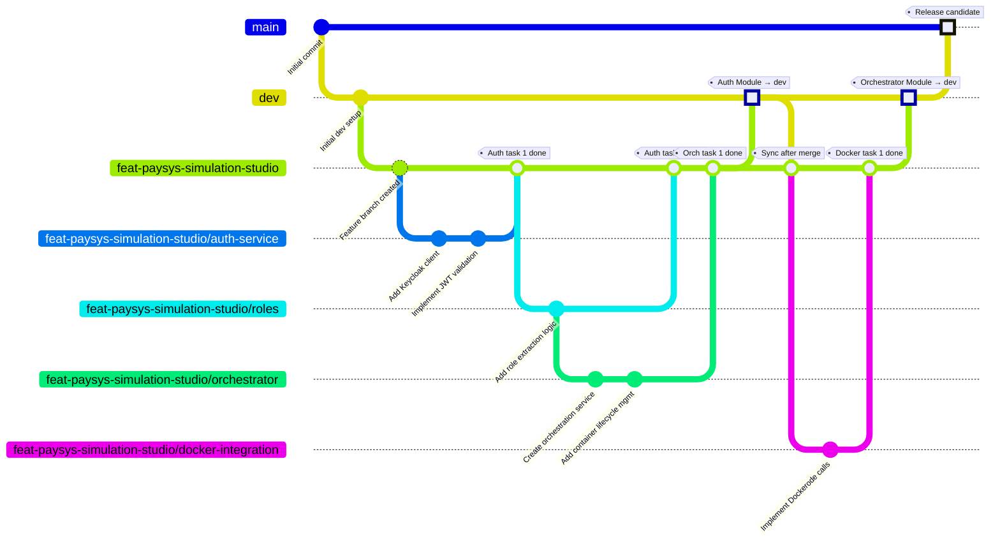

# Git Branching Strategy for Simulation Studio Development

## Executive Summary

This document outlines the branching strategy for commercial development of the Simulation Studio feature across two repositories: `rule-studio` and `admin-service`. The strategy implements a **module-gated feature branch model** that balances developer velocity with production stability through staged integration, comprehensive QA gates, and protected branch policies.

## Why This Complexity?

### The Problem We're Solving

1. **Stability Requirements**: As a commercial product, `dev` must remain production-ready at all times. Incomplete features or buggy code merging to `dev` can block other teams, delay releases, and impact customer trust.

2. **Team Scale**: With multiple developers working in parallel across two repositories, uncoordinated merges create merge conflicts, integration issues, and inconsistent testing.

3. **Module Interdependencies**: Simulation Studio has discrete modules (auth, orchestrator, Docker integration, etc.) per the Gantt chart. Some modules can be tested in isolation; others require integration testing with other modules. We need quality gates at module boundaries.

4. **Audit and Compliance**: Commercial projects often require traceability. Every change must have a PR, review trail, and CI verification — for legal, security, and debugging purposes.

5. **Rollback Granularity**: If a module breaks during integration, we want to roll back that module without affecting other completed work.

### Why Not Simpler Approaches?

| Approach | Why it doesn't work |
|---|---|
| **Direct commits to `dev`** | Violates commercial stability requirements; anyone can introduce bugs into the main branch. |
| **Each dev on a separate long-lived branch** | Integration happens late; merge conflicts compound; no shared codebase for collaboration within a module. |
| **Feature branch → dev immediately after task done** | Untested integration; modules fail when deployed together; QA can't run end-to-end flows. |
| **No staging area between feature and dev** | `dev` becomes unstable during active development; CI flakiness masks real bugs. |

## Branching Model

### Branch Hierarchy

```
main (production releases only, protected)
  ↑
  ├── dev (staging for next release, protected)
  │    ↑
  │    └── feat-paysys-simulation-studio (module integration point, semi-protected)
  │         ├── feat-paysys-simulation-studio/auth-service (dev 1)
  │         ├── feat-paysys-simulation-studio/orchestrator (dev 2)
  │         └── feat-paysys-simulation-studio/docker-integration (dev 3)
```

### Branch Definitions

| Branch | Purpose | Protection | Lifetime |
|---|---|---|---|
| `main` | Production releases | Strict: 2+ approvals, all CI pass, no force push | Permanent |
| `dev` | Staging area for release candidates | Strict: 1+ approval, all CI pass, up-to-date required | Permanent |
| `feat-paysys-simulation-studio` | Feature integration; holds all module work | Semi-strict: 1+ approval, CI pass, no force push | Duration of initiative (~6–12 months) |
| `feat-paysys-simulation-studio/*` | Individual developer tasks | None | Short-lived (days to weeks) |

### Protection Rules Applied

#### `main` branch
- Require pull request reviews: **2 approvals**
- Require status checks to pass (CI + security scanning)
- Require branches to be up to date before merging
- Dismiss stale pull request approvals when new commits are pushed
- Require signed commits
- No force push allowed

#### `dev` branch
- Require pull request reviews: **1 approval** (tech lead or senior engineer)
- Require status checks to pass (full CI suite)
- Require branches to be up to date before merging
- Dismiss stale reviews
- No force push allowed

#### `feat-paysys-simulation-studio` branch
- Require pull request reviews: **1 approval** (module lead or peer)
- Require status checks to pass (unit + integration tests)
- Squash or rebase merges recommended (keeps history clean)
- No force push allowed (preserve audit trail)

## Development Workflow

### Phase 1: Setup (Once at Start of Initiative)

```bash
# In rule-studio repo
git checkout dev
git pull origin dev
git checkout -b feat-paysys-simulation-studio
git push -u origin feat-paysys-simulation-studio

# In admin-service repo
git checkout dev
git pull origin dev
git checkout -b feat-paysys-simulation-studio
git push -u origin feat-paysys-simulation-studio
```

### Phase 2: Development (Per Task)

#### Developer creates task branch

```bash
# In rule-studio repo
git checkout feat-paysys-simulation-studio
git pull origin feat-paysys-simulation-studio
git checkout -b feat-paysys-simulation-studio/auth-service
# ... do work ...
git push -u origin feat-paysys-simulation-studio/auth-service
```

#### Developer opens PR to feature branch

- Title: `[rule-studio] Add Keycloak integration for Simulation Studio auth`
- Description includes:
  - What was implemented
  - Testing done locally
  - Any breaking changes
  - Link to Gantt chart task
- Assign to module lead for review
- CI runs automatically (unit tests, linting, type checking)

#### Code review on feature branch

- Reviewer checks: correctness, adherence to existing patterns, security
- Runs tests locally if needed
- Approves or requests changes
- Merges (squash recommended to keep feature branch clean)

#### Developer deletes task branch

```bash
git branch -d feat-paysys-simulation-studio/auth-service
git push origin --delete feat-paysys-simulation-studio/auth-service
```

### Phase 3: Module Integration & QA (At Gantt Milestone)

When Auth Service module is complete (all tasks merged to `feat-paysys-simulation-studio`):

#### 1. Sync feature branch with dev

```bash
git checkout feat-paysys-simulation-studio
git pull origin feat-paysys-simulation-studio
git pull origin dev  # Merge latest dev changes
git push origin feat-paysys-simulation-studio
```

**Why**: Ensures feature branch includes any hot fixes or other work merged to `dev` while we were developing. Catches integration conflicts before the PR.

#### 2. Run module-level QA

In **both** repositories:
- Run full CI pipeline (unit + integration tests)
- QA team runs end-to-end test scenarios for the Auth module
- Cross-repo integration testing (rule-studio calls admin-service endpoints)
- Load testing (if applicable)
- Security scan (if applicable)

#### 3. Document test results

Create a QA sign-off document:
```
## Auth Service Module - QA Sign-Off
- Date: 2026-06-15
- Tested by: QA Team
- Environments: dev, staging
- Test cases passed: 47/47
- Known issues: None
- Ready for dev merge: YES ✓
```

#### 4. Create PR to dev

One person (tech lead) creates a comprehensive PR:

**In rule-studio:**
```
Title: [Module] Auth Service - Simulation Studio integration
Body:
## Overview
Completes Auth Service module for Simulation Studio, covering:
- Keycloak integration
- JWT validation
- Role-based access control

## Changes
- New: `src/services/simulation-studio/auth/`
- Modified: `src/app.module.ts` (import module)
- Tests: 23 new unit tests, 5 integration tests

## QA Sign-Off
✓ All tests passing
✓ QA module testing complete (see attachment)
✓ No breaking changes

## Related
- Gantt chart: https://...
- PR link in admin-service: https://...
```

**In admin-service:**
```
Title: [Module] Auth Service - Simulation Studio integration
Body:
## Overview
Implements admin-service side of Auth module:
- Session validation endpoints
- Claims extraction
- JWT refresh logic

## Changes
- New: `src/services/simulation-studio/auth/`
- Modified: `src/router.ts`
- Tests: 18 new unit tests

## QA Sign-Off
✓ All tests passing
✓ Cross-repo integration tested with rule-studio
✓ No breaking changes

## Related
- Gantt chart: https://...
- Coordinated PR in rule-studio: https://...
```

#### 5. Code review on dev PR

- Reviewers: Tech lead + 1 senior engineer minimum
- Check: code quality, security, test coverage, architecture
- Ensure CI passes (all checks must be green)
- Ensure branch is up-to-date with dev

#### 6. Merge to dev

Once approved:
```bash
# (via GitHub UI, not CLI)
# Select: "Squash and merge" or "Create a merge commit"
# Message: "[Auth Module] Simulation Studio integration (#123)"
```

**Why squash?** Keeps `dev` history clean; individual task commits are less important once integrated.

#### 7. Prepare for next module

```bash
git checkout feat-paysys-simulation-studio
git pull origin dev  # Get the merged code back
git push origin feat-paysys-simulation-studio
```

Now ready for next module (e.g., Orchestrator) to be developed.

## Mermaid Diagram: Full Workflow



## Parallel Development Across Repositories

Since Simulation Studio spans **rule-studio** and **admin-service**, coordinate as follows:

### Same Module, Both Repos

When a module requires changes in both repos (e.g., Auth Service):

1. **Create branches in both repos** with the same name:
   - `feat-paysys-simulation-studio/auth-service` in rule-studio
   - `feat-paysys-simulation-studio/auth-service` in admin-service

2. **Link PRs** in both repos:
   ```
   Checklist:
   - [ ] PR #123 in rule-studio approved
   - [ ] PR #456 in admin-service approved
   - [ ] Integration tests pass across both repos
   ```

3. **Merge to feature branches at the same time** (within minutes):
   ```bash
   # Merge in rule-studio, then immediately in admin-service
   # This keeps feature branches in sync
   ```

4. **Module QA tests both repos together**:
   - Spin up local instances of both services
   - Run end-to-end test scenarios
   - Verify no breaking changes between repos

5. **Single PR to dev in each repo** (coordinated):
   ```
   rule-studio PR #300: "[Module] Auth Service - rule-studio"
   admin-service PR #150: "[Module] Auth Service - admin-service"
   Both with same timestamp, linked to each other
   ```

### Different Modules, Different Repos

If a module only touches one repo:
- That repo's developers work independently
- QA tests in isolation
- PR to dev when complete
- No synchronization needed

### Risk: Out-of-Sync Feature Branches

**Problem**: If one repo's feature branch merges a module to `dev` but the other doesn't, they drift.

**Solution**: Synchronization checkpoint after each module:
```bash
# After rule-studio auth module merges to dev:
# In admin-service, pull dev:
git checkout feat-paysys-simulation-studio
git pull origin dev
git push origin feat-paysys-simulation-studio

# Both repos' feature branches now contain auth module
```

## Role Assignments

### Tech Lead
- Creates PRs to `dev` (one person per module for clarity)
- Approves PRs to feature branch (module lead)
- Coordinates module QA
- Handles merge conflicts
- Owns `feat-paysys-simulation-studio` health

### Module Lead (Per Module)
- Assigns tasks to developers
- Reviews code on feature branch PRs
- Runs module-level QA
- Signs off on module completion

### Developers
- Create task branches
- Open PRs to feature branch
- Implement assigned features
- Write tests
- Respond to code review

### QA Team
- Develops test cases per module
- Runs end-to-end testing
- Documents test results
- Signs off on module readiness
- Performs load/security testing as needed

## Incident Response

### Broken Build on Feature Branch

1. **Identify**: CI fails on a PR to `feat-paysys-simulation-studio`
2. **Action**: Block the merge until fixed; developer must update PR
3. **Timeline**: Fix within 24 hours or revert the branch

### Bug Found After Module Merged to Dev

1. **If critical**: Revert the module PR to dev
   ```bash
   git revert -m 1 <merge-commit-hash>
   ```
2. **Fix in feature branch**, re-test, re-PR
3. **If non-critical**: Create a follow-up PR to dev with the fix

### Merge Conflict During Sync

1. **Occurs during**: `git pull origin dev` in feature branch
2. **Resolution**:
   - Tech lead resolves conflicts (keeping feature code, accepting dev fixes)
   - Rerun tests to ensure resolution is correct
   - Push resolved branch
   - Document conflict in team chat

## Definitions

### "Module Complete" (per Gantt)
- All assigned tasks merged to `feat-paysys-simulation-studio`
- All unit tests passing
- Module integration tests passing
- Code review complete
- QA sign-off obtained
- Ready for merge to `dev`

### "Ready for Production" (per Release)
- Module merged to `dev`
- Integration tested with other modules on `dev`
- Performance/load tested
- Security scanned
- Released to staging environment
- UAT passes
- Merged to `main`

## Checklist: Setting Up This Strategy

### Before Development Starts

- [ ] Create `feat-paysys-simulation-studio` branch in rule-studio from `dev`
- [ ] Create `feat-paysys-simulation-studio` branch in admin-service from `dev`
- [ ] Enable branch protection on `dev` (1 approval, CI pass, up-to-date)
- [ ] Enable branch protection on `main` (2 approvals, CI pass, no force push)
- [ ] Configure `feat-paysys-simulation-studio` to require 1 approval on PRs
- [ ] Set up CI/CD pipelines for both repos
- [ ] Assign Tech Lead and Module Leads
- [ ] Create QA test plan per module
- [ ] Document task assignment in Gantt chart

### Per Module Development

- [ ] Create task branches off `feat-paysys-simulation-studio`
- [ ] Developers open PRs to feature branch
- [ ] Code review + CI pass
- [ ] Merge to feature branch (squash recommended)
- [ ] Run module QA tests
- [ ] Create comprehensive PR to `dev`
- [ ] Code review by tech lead + senior engineer
- [ ] Merge to `dev`
- [ ] Sync feature branch with `dev`
- [ ] Document module completion

## FAQ

### Q: Why not merge task branches directly to `dev`?
**A**: Untested integration. Tasks may work in isolation but break together. The feature branch lets us batch-test modules before they hit `dev`.

### Q: Why sync the feature branch with `dev` after each module?
**A**: Other teams might fix bugs or add hot fixes to `dev` while we're developing. We need to catch those conflicts early, before the next big PR. Also prevents drift.

### Q: What if a developer needs to work on code from two modules?
**A**: Create a task branch naming the primary module:
```
feat-paysys-simulation-studio/auth-service-docker-integration
```
Once approved, merge to `feat-paysys-simulation-studio`. The work is now part of both module test phases.

### Q: Can we skip QA for a small fix?
**A**: Not for code going to `dev`. Small fixes still need to go through the feature branch, be reviewed, and pass CI. QA can be abbreviated if the change is truly minimal (e.g., one-line comment fix), but document that decision.

### Q: What if `dev` has a breaking change and our feature branch breaks?
**A**: This is why we sync frequently. If a large breaking change hits `dev`:
1. Sync the feature branch immediately
2. Fix the code to work with the new API
3. Rerun tests
4. Continue development

If the change is too disruptive, escalate to tech lead — may need to revert the `dev` change or delay the feature branch sync.

### Q: Do we need the same branches in both repos?
**A**: For the same module, yes. For independent modules, no. Use naming consistency so it's clear which feature branches are related.

### Q: What happens to the feature branch after the initiative is done?
**A**: Keep it for hotfix development during the pilot/beta phase. Once Simulation Studio is fully in production and stable on `main`, delete the branch. Any future work goes on new feature branches.

## References

- **Gantt Chart**: [Link to project management tool]
- **Architecture**: [See `architecture.md`]
- **Database Schema**: [See `database-migration.sql`]
- **API Contracts**: [See respective repos' OpenAPI specs]

---

**Document Version**: 1.0  
**Last Updated**: 2026-05-24  
**Owner**: Tech Lead - Simulation Studio Initiative
