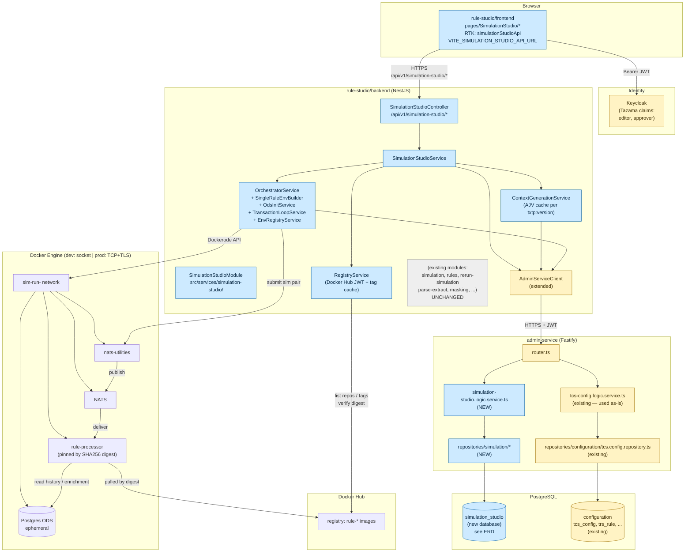

# Simulation Studio — High-Level Architecture

Logical deployment view. `connection-studio/` is shown only because it shares the `admin-service` and the same auth — **no new code lands there**.

## What's new vs. what's reused

| Layer | NEW (this initiative) | REUSED (existing) | UNTOUCHED |
|---|---|---|---|
| Frontend | `pages/SimulationStudio/*`, `simulationStudioApi` slice, `<Stepper />`, `<FieldConfigurator />` | `StatusCard`, `Table`, `TableActions`, `DropDown`, `Input`, `BoxWrapper`, `JsonFormatter`, `AccordianSummary`, `useFilters` | All legacy `pages/Simulation*`, `simulationApi` |
| rule-studio backend | `services/simulation-studio/*` module (controller, service, registry, orchestrator, context-gen, dto) | `TazamaAuthGuard`, `RequireAnyClaims`, `AdminServiceClient` (extended) | `services/simulation/`, `services/rerun-simulation/`, etc. |
| admin-service | `services/simulation-studio.logic.service.ts`, `repositories/simulation/*` | `tcs-config.logic.service.ts`, `enrichment-utils.validateTableName`, repo pattern, `PaginatedResult<T>` | All existing handlers |
| Database | `simulation_studio` DB (per migration, post §3.2 edits) | `configuration` DB (`tcs_config`) — read-only via existing admin handlers | All existing tables |
| Runtime | Dockerode-driven `sim-run-<id>` networks + 4-container envs | Docker Hub auth pattern | — |

## Trust boundaries

1. **Browser → rule-studio/backend.** JWT bearer; `TazamaAuthGuard` validates and extracts `AuthenticatedUser` (`tenantId`, `userId`).
2. **rule-studio/backend → admin-service.** Same JWT forwarded through `AdminServiceClient`. All tenant filtering enforced inside admin-service repositories.
3. **rule-studio/backend → Docker Engine.** Out-of-band (socket or mTLS). Each run gets a network namespace; nothing crosses runs.
4. **rule-studio/backend → Docker Hub.** Service-account JWT (50-min TTL cache).
