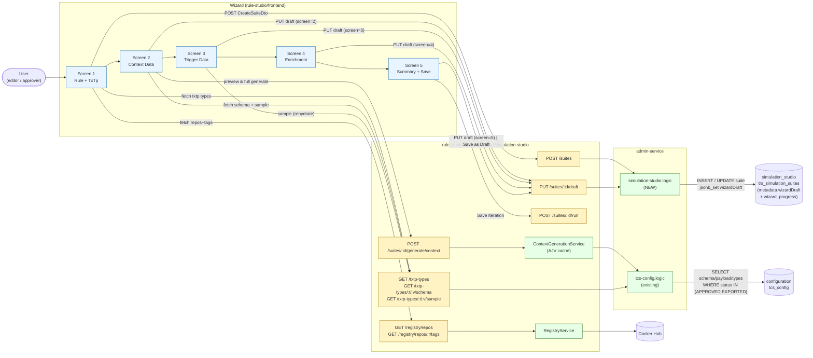
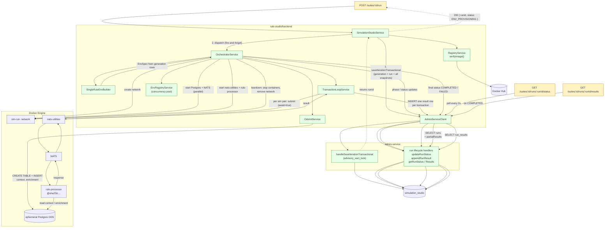

# Simulation Studio — Data Flow Diagram

Two views: (1) wizard authoring data flow, (2) run execution data flow. Both render natively in GitHub via Mermaid.

---

## 1. Wizard authoring — DRAFT to saved Iteration

**Key data items in flight:**
- `wizardDraft.screen1..screen5` accumulates in `trs_simulation_suites.metadata` (JSONB). No child tables are written until **Save Iteration**.
- `wizard_progress` is the resume cursor: `{ "screen1": true, ... }`.
- Generated context payloads live in client state during the wizard; persisted to `trs_suite_context_generated_messages` only on `POST /run`.

---

## 2. Run execution — POST /run → results

**Key data items in flight:**
- `verifyImage()` returns a SHA256 digest pinned into `trs_simulation_runs.rule_image_digest` *before* the transaction commits — so reruns are byte-identical.
- The single admin transaction (`handleSaveIterationTransactional`) writes: generation, all context/trigger/enrichment configs + generated rows, all sim pairs, the run row, and increments suite counters. All-or-nothing — orchestrator never starts on rollback.
- The transaction loop persists results **immediately** after each nats-utilities response (T-03 — not batched). UI receives them via `partialResults` on the status endpoint when needed; current Screen 6 only displays on terminal state.
- Crash recovery (T-04) on backend startup: list Docker containers labelled `run_id=*`, cross-reference `trs_simulation_runs.status`, force any non-terminal run to `FAILED` and tear down.
