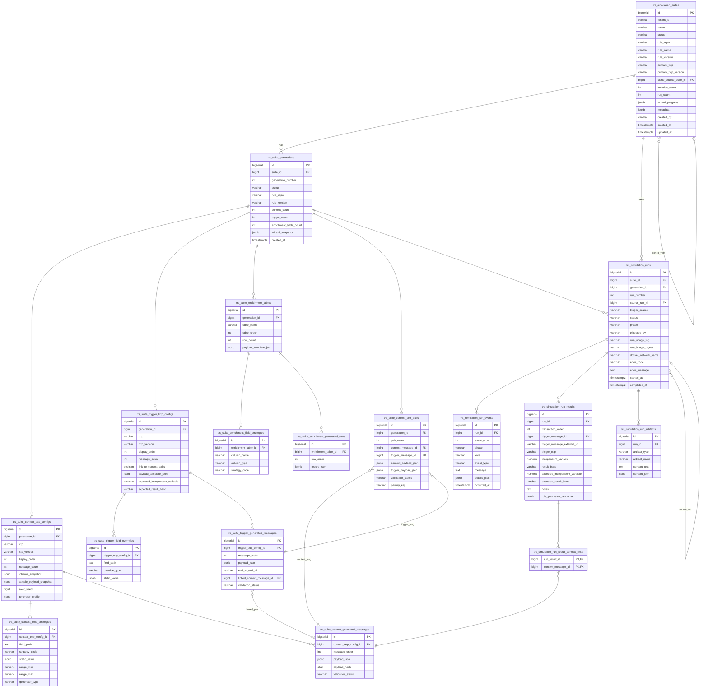

# Simulation Studio — Entity Relationship Diagram

Reflects [database-migration.sql](../database-migration.sql) **after** the §3.2 edits in [implementation_report.md](../implementation_report.md):
- `trs_suite_txtp_configs` dropped (redundant union)
- `trs_suite_context_sim_payloads` dropped (payloads inline on pairs)

## Key invariants

- **Tenant scoping** lives on `trs_simulation_suites.tenant_id` only. All child queries must join through and filter on it.
- **Iteration immutability:** `trs_suite_generations` rows are immutable after `saveIterationTransactional`. New iterations create a new row, not an update.
- **Run-number allocation:** `UNIQUE (suite_id, generation_id, run_number)` enforced by DB; computed under `pg_advisory_xact_lock(hashtext(suite_id || ':' || generation_id))`.
- **Pairing:** A trigger message can independently belong to (a) one or more pair rows in `trs_suite_context_sim_pairs`, and (b) a context message via `linked_context_message_id` when `link_to_context_pairs = true`.
