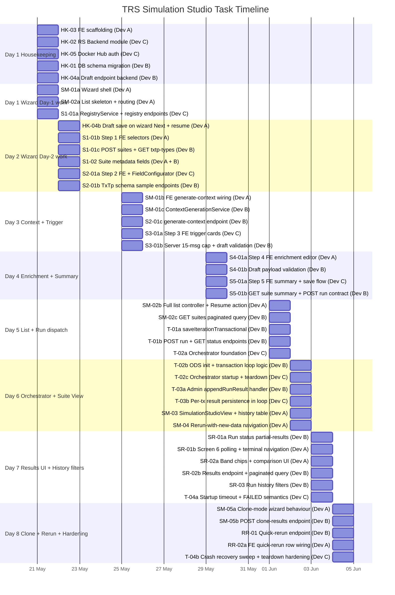
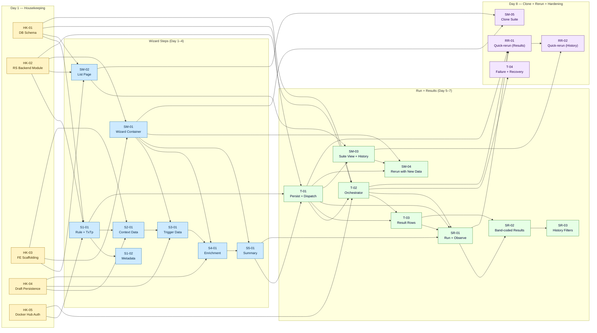

# TRS Simulation Studio — Gantt Chart

**Single-Rule Simulation · 8 Working Days · 3 Developers · Integration Testing excluded**

> **Version:** v2.0 · 2026-05-24
> **Aligned with:** [implementation_plan.md](implementation_plan.md) v3.1 and [User-Stories-20260520-EOD.md](User-Stories-20260520-EOD.md).
> **Label `[OUTSIDE-US]`** marks housekeeping stories that are outside the user stories document.

This Gantt chart is dependency-aware: every task bar starts on or after the day its prerequisites are met. Long-span stories (SM-01, SM-02, T-01) are broken into per-day task bars so the dependency flow is explicit. The mermaid Gantt uses `after` dependencies for any task whose start is gated by another task's completion.

---

## Working Day Calendar

| Day | Date |
|-----|------|
| 1 | 21 May 2026 (Thu) |
| 2 | 22 May 2026 (Fri) |
| 3 | 25 May 2026 (Mon) |
| 4 | 29 May 2026 (Thu) |
| 5 | 01 Jun 2026 (Mon) |
| 6 | 02 Jun 2026 (Tue) |
| 7 | 03 Jun 2026 (Wed) |
| 8 | 04 Jun 2026 (Thu) |

> Days 3 (25 May) → 4 (29 May) span a four-day gap (weekend + public holiday). Days 4 → 5 span a three-day gap (weekend). No work is scheduled on the gap days.

---

## Story Timeline (Gantt)

The Gantt below shows **task-level** bars (not story-level), grouped by phase. Each task has an explicit start date matching the [Working Day Calendar](#working-day-calendar). Parallel work on the same day is explicit (FE / BE / orchestration are independent tracks). Cross-task dependencies are documented in the [Dependency Graph](#dependency-graph) below.



---

## Dependency Graph

The directed-graph view below shows hard story-level dependencies — `A --> B` means *B cannot finish until A is delivered*. Housekeeping (HK) stories all complete on Day 1 and unblock the wizard layer on Day 1–2.



---

## Story-to-Task Breakdown

This table is the canonical day-by-day developer assignment, mirroring the per-story Task Division sections of [implementation_plan.md](implementation_plan.md). Days are 1-indexed against the [Working Day Calendar](#working-day-calendar).

| Story | Day | Dev | Task |
|---|---|---|---|
| **HK-03** | 1 | Dev A | Frontend scaffolding: routes, page directory, `<SimulationStudioWizard />` shell skeleton, `<Stepper />`, `<FieldConfigurator />`, `simulationStudioApi` slice + store registration, `VITE_SIMULATION_STUDIO_API_URL`, `<StatusCard />` DRAFT case, `<SimulationStudioList />` skeleton. |
| **HK-02** | 1 | Dev C | RS Backend module scaffolding: directory + `SimulationStudioModule` + `SimulationStudioController` + DTOs; `AdminServiceClient` injection; all 17 routes stubbed; `AppModule` registration. |
| **HK-05** | 1 | Dev C | Docker Hub auth: `RegistryService` skeleton, `getToken()` with 50-min TTL, tag-list `Map` cache (5-min TTL), env vars (`DOCKER_HUB_USER`, `DOCKER_HUB_TOKEN`, `DOCKER_HUB_NAMESPACE`). |
| **HK-01** | 1 | Dev B | DB schema migration: provision `simulation_studio` database, apply [database-migration.sql](database-migration.sql), verify all 17 tables + the composite index `idx_sim_suites_tenant_status_updated`. |
| **HK-04** | 1 | Dev B | `PUT /suites/:id/draft` RS Backend endpoint + `UpdateDraftDto` validation + admin handler with `jsonb_set` UPDATE. |
| **HK-04** | 2 | Dev A | Wire draft save on every wizard Next + resume-flow rehydration on `/simulation-studio/edit/:id`. |
| **SM-01** | 1 | Dev A | `<SimulationStudioWizard />` shell — stepper, validation gate, blockers, mode detection (create/edit/clone), resume-load. |
| **SM-01** | 3 | Dev A | FE `POST /suites/:id/generate/context` wiring for preview (count=5) and Step 2 → Step 3 transition. |
| **SM-01** | 3 | Dev B | `ContextGenerationService` (AJV cache, schema compile, payload generation, `422` row-level errors). |
| **SM-02** | 1 | Dev A | `<SimulationStudioList />` skeleton page + routing + placeholder table. |
| **SM-02** | 5 | Dev A | Full searchable / filterable list controller using `useFilters()`; `<TableActions onResume>` extension; Resume eligibility logic. |
| **SM-02** | 5 | Dev B | `GET /suites` endpoint + `ListSuitesQueryDto` + admin paginated query + `SimulationSuiteRepository`. |
| **S1-01** | 1 | Dev C | `RegistryService.listRepos`, `listTags`, `verifyImage` + `GET /registry/repos`, `GET /registry/repos/:repo/tags`. |
| **S1-01** | 2 | Dev A | Step 1 frontend — rule picker, version picker, primary TxTp picker, primary TxTp version picker; edit-mode locks on rule + TxTp. |
| **S1-01** | 2 | Dev B | `POST /suites` create flow + `GET /txtp-types` pass-through via `AdminServiceClient`. |
| **S1-02** | 2 | Dev A | Suite name + description inputs with character counters and required-field validation. |
| **S1-02** | 2 | Dev B | DTO validation (`name` `@MaxLength(120)`, `description` `@MaxLength(500)`). |
| **S2-01** | 2 | Dev C | Step 2 frontend — TXTP table + `<FieldConfigurator />` + Preview Data + per-screen draft-save wiring. |
| **S2-01** | 2 | Dev B | RS Backend TxTp / schema / sample pass-through endpoints + `AdminServiceClient` wrappers. |
| **S2-01** | 3 | Dev B | `POST /suites/:id/generate/context` admin handler + `422` row-level validation shape. |
| **S3-01** | 3 | Dev C | Step 3 frontend — trigger JSON cards + message-count validation + draft-save wiring. |
| **S3-01** | 3 | Dev B | Server-side Step 3 draft validation + 15-message cap enforcement. |
| **S4-01** | 4 | Dev A | Step 4 frontend — enrichment editor + saved list + remove + draft-save wiring. |
| **S4-01** | 4 | Dev B | Draft-payload validation for table-name (reuse `validateTableName`) and payload constraints. |
| **S5-01** | 4 | Dev C | Step 5 frontend — read-only summary + Save as Draft + Save Iteration navigation. |
| **S5-01** | 4 | Dev B | `GET /suites/:id` summary + `POST /suites/:id/run` dispatcher contract. |
| **T-01** | 5 | Dev B | `handleSaveIterationTransactional` — advisory lock, compute `run_number`, INSERT all snapshot rows + run row, update suite counters, commit. |
| **T-01** | 5 | Dev B | RS Backend `POST /run` (fire-and-forget dispatch) + `GET /runs/:runId/status` with status/phase/error payload. |
| **T-02** | 5 | Dev C | Orchestrator foundation — Dockerode client, network helpers, `SingleRuleEnvBuilder`. |
| **T-02** | 6 | Dev B | `OdsInitService` + `TransactionLoopService` logic (sequential sim pair submission to nats-utilities). |
| **T-02** | 6 | Dev C | Orchestrator startup sequence (NETWORK_CREATE → BASE_CONTAINERS_START → ODS_INIT → APP_CONTAINERS_START → TRANSACTION_LOOP → CLEANUP) + health checks + teardown. |
| **T-03** | 6 | Dev B | Admin `appendRunResult` handler + run status updates + partial-results support. |
| **T-03** | 6 | Dev C | Per-transaction immediate result persistence in `TransactionLoopService` (one INSERT per nats-utilities response). |
| **SM-03** | 6 | Dev A | Full `<SimulationStudioView />` overview + iteration history table + action stubs. |
| **SM-04** | 6 | Dev A | "Rerun with New Data" navigation + edit-mode wizard pre-population + locked rule/TxTp behaviour. |
| **SR-01** | 5 | Dev B | Run status endpoint returning `status` / `phase` / `error_message` (+ `partialResults`). |
| **SR-01** | 7 | Dev A | Screen 6 polling lifecycle (2 s cadence) + terminal-state navigation + result presentation shell. |
| **SR-02** | 7 | Dev A | Band chips + stat cards + expected-vs-actual comparison UI. |
| **SR-02** | 7 | Dev B | `GET /runs/:runId/results` endpoint + run-list endpoint + admin paginated query. |
| **SR-03** | 7 | Dev B | Run-history filter params (`ruleVersion`, `dateFrom`, `dateTo`, `search`) on `GET /suites/:id/runs`. |
| **T-04** | 7 | Dev C | Startup timeout + failure handling + `FAILED` status write semantics + per-phase timeouts. |
| **T-04** | 8 | Dev C | Crash-recovery sweep on backend startup (`run_id=*` label scan) + orphan cleanup + idempotent teardown hardening. |
| **SM-05** | 8 | Dev A | Clone-mode wizard behaviour + locked identity fields (rule + primary TxTp). |
| **SM-05** | 8 | Dev B | `POST /suites/:id/clone-results` — single-transaction copy of runs + results + context_links. |
| **RR-01** | 8 | Dev B | Quick-rerun endpoint `POST /suites/:id/generations/:generationId/quick-rerun` + run row insert + dispatch (same advisory lock as T-01). |
| **RR-02** | 8 | Dev B | Reuses RR-01 endpoint. |
| **RR-02** | 8 | Dev A | Iteration-row Rerun button wiring + per-row loading + refresh to show new run sub-row. |
| **T-05** | — | — | Out of scope this release. Platform deployment workflow; no Simulation Studio code change. |

---

## Story Schedule Reference

This table records the **earliest start** and **latest end** day for each story across its task slices. Stories like SM-01, SM-02, S2-01, SR-01 carry two non-contiguous task days because they pair a Day-1 (or Day-5) scaffold with a later build-out — see the per-day [Story Timeline](#story-timeline-gantt) bars for details.

| Story | Title | Start | End | Source |
|-------|-------|-------|-----|--------|
| HK-03 | Frontend Project Scaffolding | 21 May 2026 | 21 May 2026 | Housekeeping [OUTSIDE-US] |
| HK-02 | RS Backend NestJS Module Scaffolding | 21 May 2026 | 21 May 2026 | Housekeeping [OUTSIDE-US] |
| HK-05 | Docker Hub Authentication | 21 May 2026 | 21 May 2026 | Housekeeping [OUTSIDE-US] |
| HK-01 | Database Schema Migration | 21 May 2026 | 21 May 2026 | Housekeeping [OUTSIDE-US] |
| HK-04 | Per-Screen Draft Persistence Infrastructure | 21 May 2026 | 22 May 2026 | Housekeeping [OUTSIDE-US] |
| SM-01 | Create a New Simulation Suite via Simulation Studio | 21 May 2026 | 25 May 2026 | User stories document |
| SM-02 | View All Simulation Suites in a Searchable List | 21 May 2026 | 01 Jun 2026 | User stories document |
| S1-01 | Select a Rule and Transaction Version for the Suite | 21 May 2026 | 22 May 2026 | User stories document |
| S1-02 | Define Suite Metadata | 22 May 2026 | 22 May 2026 | User stories document |
| S2-01 | Configure Context Data | 22 May 2026 | 25 May 2026 | User stories document |
| S3-01 | Configure and Preview Simulation Trigger Transactions | 25 May 2026 | 25 May 2026 | User stories document |
| S4-01 | Define One or More Enrichment Tables | 29 May 2026 | 29 May 2026 | User stories document |
| S5-01 | Review the Full Suite Summary Before Saving | 29 May 2026 | 29 May 2026 | User stories document |
| T-01 | Atomically Persist Wizard Data and Dispatch Orchestrator on Run | 01 Jun 2026 | 01 Jun 2026 | User stories document |
| SR-01 | Run a Simulation and Observe Results Upon Completion | 01 Jun 2026 | 03 Jun 2026 | User stories document |
| T-02 | Orchestrate an Isolated Docker Container Lifecycle Per Run | 01 Jun 2026 | 02 Jun 2026 | User stories document |
| T-03 | Persist One Result Row Per Sim Transaction | 02 Jun 2026 | 02 Jun 2026 | User stories document |
| SM-03 | View Suite Details and Iteration History | 02 Jun 2026 | 02 Jun 2026 | User stories document |
| SM-04 | Run a New Iteration in an Existing Suite | 02 Jun 2026 | 02 Jun 2026 | User stories document |
| SR-02 | View Simulation Results with Band-Coded Outcome Per Transaction | 03 Jun 2026 | 03 Jun 2026 | User stories document |
| SR-03 | Search and Filter Simulation History | 03 Jun 2026 | 03 Jun 2026 | User stories document |
| T-04 | Handle Container Startup Failures and Run Timeouts Gracefully | 03 Jun 2026 | 04 Jun 2026 | User stories document |
| SM-05 | Clone an Existing Suite | 04 Jun 2026 | 04 Jun 2026 | User stories document |
| RR-01 | Rerun a Past Iteration from Simulation Result Page | 04 Jun 2026 | 04 Jun 2026 | User stories document |
| RR-02 | Rerun a Past Iteration from Simulation Suite History | 04 Jun 2026 | 04 Jun 2026 | User stories document |
| T-05 | Push Rule Processor Image to Registry on Deployment | — | — | User stories document (out of scope this release) |

> SM-01 and SM-02 each span multiple non-contiguous task days (Day 1 skeleton + Day 3 / Day 5 build-out). The "End" column reflects the final task day; the Day 1 work is the scaffolding that other stories consume.

---

## Per-Developer Daily Load

Headcount: Dev A (frontend lead), Dev B (backend + persistence lead), Dev C (frontend + orchestration). Each developer covers between one and four discrete tasks per day depending on phase. Per-day load:

| Day | Date | Dev A | Dev B | Dev C |
|---|---|---|---|---|
| 1 | 21 May | HK-03 FE scaffolding; SM-01a wizard shell; SM-02a list skeleton | HK-01 DB schema; HK-04a draft endpoint | HK-02 backend module; HK-05 Docker Hub auth; S1-01a RegistryService |
| 2 | 22 May | HK-04b draft wiring; S1-01b Step 1 FE; S1-02 inputs | S1-01c `POST /suites` + TxTp pass-through; S1-02 DTO; S2-01b TxTp / schema / sample endpoints | S2-01a Step 2 FE + `<FieldConfigurator />` |
| 3 | 25 May | SM-01b FE generate/context wiring | SM-01c `ContextGenerationService`; S2-01c generate/context endpoint; S3-01b 15-msg cap + validation | S3-01a Step 3 FE trigger cards |
| 4 | 29 May | S4-01a Step 4 FE enrichment editor | S4-01b draft payload validation; S5-01b `GET /suites/:id` summary + `POST /run` contract | S5-01a Step 5 FE summary + save flow |
| 5 | 01 Jun | SM-02b full list controller + Resume action | SM-02c `GET /suites` paginated; T-01a `saveIterationTransactional`; T-01b run endpoints | T-02a orchestrator foundation (Dockerode, networks, EnvBuilder) |
| 6 | 02 Jun | SM-03 SimulationStudioView + history; SM-04 rerun-with-new-data | T-02b ODS init + transaction loop logic; T-03a admin `appendRunResult` | T-02c orchestrator startup + teardown; T-03b per-tx result persistence in loop |
| 7 | 03 Jun | SR-01b Screen 6 polling + terminal navigation; SR-02a band chips + comparison UI | SR-01a run status + partial-results; SR-02b results endpoint + paginated query; SR-03 run-history filters | T-04a startup timeout + FAILED semantics |
| 8 | 04 Jun | SM-05a clone-mode wizard; RR-02a quick-rerun row wiring | SM-05b clone-results endpoint; RR-01 quick-rerun endpoint | T-04b crash-recovery sweep + teardown hardening |

---

## Dependency Audit

This section verifies that every story is scheduled only after all of its declared prerequisites (per [implementation_plan.md](implementation_plan.md) Prerequisites blocks) are satisfied. Where a story shares its start day with a prerequisite, the dependency is resolved at the **task** level — the task that consumes the prereq starts on a later day than the task that delivers it.

| Story | Start | Prerequisites (latest delivery day) | Verdict |
|---|---|---|---|
| SM-01 | Day 1 | HK-03 (Day 1), HK-02 (Day 1), S1-01 (Day 1–2) | ✓ Day 1 task is SM-01a (wizard shell), which only needs HK-03. The S1-01-consuming task SM-01b (generate/context wiring) runs Day 3 — after S1-01c completes on Day 2. |
| SM-02 | Day 1 | HK-03 (Day 1), HK-01 (Day 1), HK-02 (Day 1), S1-01 (Day 1–2) | ✓ Day 1 task is SM-02a (list skeleton), which only needs HK-03. The S1-01-consuming task SM-02b (full list with Rule filter dropdown) runs Day 5 — well after S1-01 completes on Day 2. |
| S1-01 | Day 1 | HK-01 (Day 1), HK-02 (Day 1), HK-05 (Day 1) — all parallel on Day 1 | ✓ Day 1 task is S1-01a (RegistryService), which is independent of HK-01 / HK-02 work products. S1-01c (`POST /suites`) runs Day 2, after HK-04a delivers the draft endpoint and HK-02 delivers the controller. |
| S1-02 | Day 2 | S1-01 (Day 2) | ✓ Same-day at task level: S1-02 consumes S1-01b/c outputs that land earlier on Day 2. |
| S2-01 | Day 2 | S1-01 (Day 2), HK-03 (Day 1), HK-04 (Day 2) | ✓ S2-01a needs only HK-03 (Day 1) + HK-04a (Day 1). S2-01b runs in parallel. S2-01c (Day 3) consumes S2-01b. |
| S3-01 | Day 3 | S2-01 (Day 3), SM-01 (Day 3), HK-04 (Day 2) | ✓ S3-01a/b consume Day 2 outputs of S2-01a/b. SM-01a shell delivered Day 1. |
| S4-01 | Day 4 | SM-01 (Day 3), HK-04 (Day 2), S3-01 (Day 3) | ✓ All prereqs delivered by end of Day 3. |
| S5-01 | Day 4 | S4-01 (Day 4), SM-01 (Day 3) | ✓ S5-01a consumes S4-01a output earlier on Day 4. S5-01b delivers `POST /run` contract shape that T-01 will implement on Day 5. |
| T-01 | Day 5 | HK-01 (Day 1), S5-01 (Day 4), S1-01 (Day 2) | ✓ All prereqs delivered before Day 5. T-01a → T-01b runs serially on Day 5. |
| SR-01 | Day 5 | S5-01 (Day 4), T-01 (Day 5), T-02 (Day 6), T-03 (Day 6) | ✓ SR-01a (status endpoint, Day 5) only needs T-01a/b which land earlier on Day 5. SR-01b (Screen 6 polling, Day 7) waits for T-02 + T-03 to land on Day 6. |
| T-02 | Day 5 | HK-02 (Day 1), HK-05 (Day 1), HK-01 (Day 1) — also reads T-01's runs table | ✓ T-02a orchestrator foundation does not require a populated runs table — it only needs Dockerode + network primitives. T-02b/c on Day 6 require T-01a (saveIterationTx, Day 5) which lands earlier. |
| T-03 | Day 6 | T-02 (Day 6), T-01 (Day 5) | ✓ T-03a (admin appendRunResult) needs T-01a outputs. T-03b (per-tx persistence in loop) is gated on T-02b earlier on Day 6. |
| SM-03 | Day 6 | SM-02 (Day 5), T-01 (Day 5) | ✓ |
| SM-04 | Day 6 | SM-03 (Day 6), SM-01 (Day 3), T-01 (Day 5) | ✓ SM-04 starts after SM-03 lands earlier on Day 6. |
| SR-02 | Day 7 | T-03 (Day 6), SR-01 (Day 7) | ✓ SR-02a consumes SR-01b outputs earlier on Day 7. SR-02b consumes T-03a (Day 6). |
| SR-03 | Day 7 | SR-02 (Day 7) | ✓ Consumes SR-02b outputs earlier on Day 7. |
| T-04 | Day 7 | T-02 (Day 6) | ✓ |
| SM-05 | Day 8 | SM-01 + S1-01..S5-01 (≤ Day 4), SM-02 (Day 5) | ✓ |
| RR-01 | Day 8 | SR-01 (Day 7), T-01 (Day 5), T-02 (Day 6) | ✓ |
| RR-02 | Day 8 | SM-03 (Day 6), RR-01 (Day 8) | ✓ RR-02a consumes RR-01 outputs earlier on Day 8. |

**No task starts before its required upstream task ends.** Same-day story-level overlaps are resolved at the task level (a story's Day-N consumer task always starts after its Day-N producer task).

---

## Critical Path

The longest chain through the project:

```
HK-01 / HK-02 / HK-05  (Day 1)
        ↓
S1-01a Registry  (Day 1)   +   S1-01c POST suites + TxTp  (Day 2)
        ↓
S2-01a Step 2 FE  (Day 2)  +   S2-01b TxTp endpoints  (Day 2)
        ↓
S2-01c generate-context endpoint  (Day 3)  +  SM-01c ContextGenerationService  (Day 3)
        ↓
S3-01a/b  Trigger data  (Day 3)
        ↓ (weekend + public holiday gap)
S4-01a/b  Enrichment  (Day 4)
        ↓
S5-01a/b  Summary  (Day 4)
        ↓ (weekend gap)
T-01a saveIterationTransactional  (Day 5)
        ↓
T-01b POST run + status endpoint  (Day 5)
        ↓
T-02a Orchestrator foundation  (Day 5)
        ↓
T-02b/c ODS + loop + startup  (Day 6)
        ↓
T-03a/b Result persistence  (Day 6)
        ↓
SR-01b Screen 6 polling  (Day 7)
        ↓
SR-02a/b Band-coded results  (Day 7)
        ↓
RR-01 Quick-rerun  (Day 8)
```

Slack lives in SM-02 (full implementation deferred to Day 5), SM-03 / SM-04 (Day 6), and the housekeeping cluster (parallel on Day 1). Any slip on the wizard-step chain (S1 → S2 → S3 → S4 → S5) cascades directly into the T-01 / T-02 / SR-01 chain — these are the highest-risk dates.

---

## Risk-Adjusted Notes

- **Day 1 housekeeping is the highest-leverage day.** Five parallel tracks must all finish so Day 2 wizard work is unblocked. Any HK slip pushes the entire wizard sequence right.
- **Days 3 → 4 and 4 → 5 are calendar gaps**, not working days. There is no buffer between Day 3 (S3-01) and Day 4 (S4-01 / S5-01), or between Day 4 and Day 5 (T-01 / T-02 start). Code freezes on the Friday before each gap.
- **T-02 orchestration (Day 5–6) cannot be tested end-to-end** until a pullable rule-processor image exists in Docker Hub. This is a Platform-team dependency (R2 in [implementation_plan.md](implementation_plan.md) Risks).
- **Day 8 is the only buffer day.** SM-05, RR-01, RR-02, and T-04b are all Day 8 tasks; if any earlier story slips, Day 8 must absorb it.
