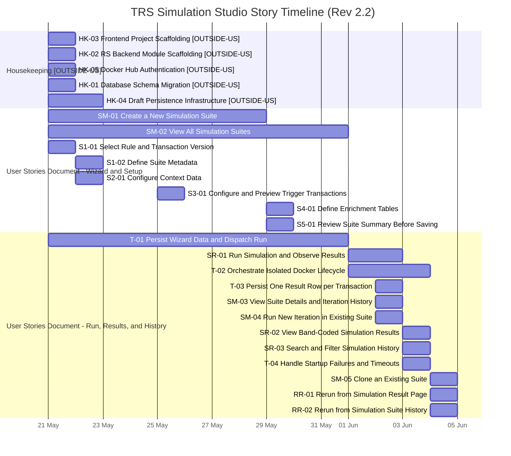

# TRS Simulation Studio — Gantt Chart

**Single-Rule Simulation · 8 Working Days · 3 Developers · Integration Testing excluded**

> Aligned to `plan/trs_story_implementation_report.original.md` (Release 4, Rev 2.2).
> Label `[OUTSIDE-US]` marks housekeeping stories that are outside the user stories document.

---

## Working Day Calendar

| Day | Date |
|-----|------|
| 1 | 21 May 2026 (Thu) |
| 2 | 22 May 2026 (Fri) |
| 3 | 25 May 2026 (Mon) |
| 4 | 29 May 2026 (Thu) |
| 5 | 01 Jun 2026 (Mon) |
| 6 | 02 Jun 2026 (Tue) |
| 7 | 03 Jun 2026 (Wed) |
| 8 | 04 Jun 2026 (Thu) |

---

## Story Timeline (Gantt)

---

## Task Breakdown Review and Update

Review outcome: **Update required and applied.**

The previous Gantt snapshot represented story time windows but did not carry the per-story **Task Division** breakdown from the implementation report. The section below now maps stories to concrete tasks by day and assignee.

## Story-to-Task Breakdown (Updated)

| Story | Source | Task Breakdown (Day / Assignee / Work) |
|-------|--------|-----------------------------------------|
| HK-03 | Housekeeping [OUTSIDE-US] | No explicit `Task Division` block in implementation report. Tracked as day-1 scaffolding story bar in Gantt. |
| HK-02 | Housekeeping [OUTSIDE-US] | No explicit `Task Division` block in implementation report. Tracked as day-1 scaffolding story bar in Gantt. |
| HK-05 | Housekeeping [OUTSIDE-US] | No explicit `Task Division` block in implementation report. Tracked as day-1 Docker Hub auth story bar in Gantt. |
| HK-01 | Housekeeping [OUTSIDE-US] | No explicit `Task Division` block in implementation report. Tracked as day-1 schema migration story bar in Gantt. |
| HK-04 | Housekeeping [OUTSIDE-US] | Day 1 / Dev B / `PUT /suites/:id/draft` RS backend endpoint + validation + admin handler. Day 2 / Dev A / Wire draft save on wizard Next + reconnect/resume flow reconstruction. |
| SM-01 | User stories document | Day 1 / Dev A / Wizard shell (`SimulationStudioWizard`) with stepper, validation gate, blockers, modes, resume-load. Day 3 / Dev A / FE `generate/context` call wiring for preview and Step 2 -> Step 3 transition. Day 3 / Dev B / ContextGenerationService + DTO/validation + AJV error handling in RS backend. |
| SM-02 | User stories document | Day 1 / Dev A / SimulationStudio list skeleton page + routing + placeholder table state. Day 5 / Dev A / Full searchable/filterable list controller + Resume action behavior. Day 5 / Dev B / `GET /suites` endpoint + admin query/handler + paginated response contract. |
| S1-01 | User stories document | Day 1 / Dev C / RegistryService (`listRepos`, `listTags`, token cache, `verifyImage`) + registry endpoints. Day 2 / Dev A / Screen 1 FE rule/version/TxTp selectors + edit-mode locks. Day 2 / Dev B / `POST /suites` create flow + `GET /txtp-types` pass-through/mapping. |
| S1-02 | User stories document | Day 2 / Dev A / Suite name + description inputs with character counters and required validation. Day 2 / Dev B / DTO validation (`name` required/max, `description` optional/max). |
| S2-01 | User stories document | Day 2 / Dev C / Screen 2 FE TXTP table + field config + preview + draft-save wiring. Day 2 / Dev B / RS backend TxTp/schema/sample endpoints + AdminServiceClient wrappers. Day 3 / Dev B / `POST /suites/:id/generate/context` implementation + 422 row-level validation shape. |
| S3-01 | User stories document | Day 3 / Dev C / Screen 3 FE trigger JSON cards + message count validation + draft-save wiring. Day 3 / Dev B / Server validation for Screen 3 draft contract + 15-transaction enforcement path. |
| S4-01 | User stories document | Day 4 / Dev A / Screen 4 FE enrichment editor/list/remove + draft-save wiring. Day 4 / Dev B / Draft payload validation for table-name/payload constraints + downstream compatibility checks. |
| S5-01 | User stories document | Day 4 / Dev C / Screen 5 FE summary render + save-as-draft + save-iteration navigation. Day 4 / Dev B / `GET /suites/:id` summary + `POST /suites/:id/run` dispatcher contract (stub-safe integration path). |
| T-01 | User stories document | Day 1 / Dev B / First-run DB initialization script for simulation studio schema. Day 3 / Dev B / Admin `saveIterationTransactional` for atomic generation/run persistence. Day 5 / Dev B / RS run endpoints (`POST /run`, `GET /runs/:runId/status`) with async dispatch/status payload. |
| SR-01 | User stories document | Day 5 / Dev B / Run status endpoint returning status/phase/error (+partial results). Day 7 / Dev A / Screen 6 FE polling lifecycle + terminal state/result presentation. |
| SR-02 | User stories document | Day 7 / Dev A / Band chips/stat cards/comparison UI components (with SR-01 flow). Day 7 / Dev B / Results endpoint + run-list endpoint + admin paginated query implementation. |
| T-02 | User stories document | Day 5 / Dev C / Orchestrator foundation (docker client/network helpers/env builder/registry). Day 6 / Dev B / ODS init + transaction loop service logic. Day 6 / Dev C / Orchestrator startup sequence + health checks + loop invocation + teardown. Day 8 / Dev C / Crash recovery + idempotent teardown hardening. |
| T-03 | User stories document | Day 6 / Dev B / Admin result-row persistence handler + status updates + partial-results support. Day 6 / Dev C / Per-transaction immediate result persistence integration in transaction loop. |
| SR-03 | User stories document | Day 7 / Dev B / Run history filter params (`ruleVersion`, `dateFrom`, `dateTo`, `search`) and query path. |
| T-04 | User stories document | Day 7 / Dev C / Startup timeout/failure handling + FAILED write semantics + timeout behavior. Day 8 / Dev C / Startup crash-recovery sweep + orphan cleanup + teardown idempotency hardening. |
| SM-03 | User stories document | Day 6 / Dev A / Full `SimulationStudioView` overview + iteration history table + action stubs/wiring baseline. |
| SM-04 | User stories document | Day 6 / Dev A / "Rerun with New Data" navigation + edit-mode generation prefill + locked rule/TxTp behavior. |
| SM-05 | User stories document | Day 8 / Dev A / Clone-mode wizard behavior and locked identity fields. Day 8 / Dev B / `POST /suites/:id/clone-results` to copy runs/results into cloned suite. |
| RR-01 | User stories document | Day 8 / Dev B / Quick rerun endpoint (`POST /suites/:id/generations/:generationId/quick-rerun`) + run insert + dispatch. |
| RR-02 | User stories document | Day 8 / Dev B / Uses RR-01 backend endpoint. Day 8 / Dev A / Iteration-row rerun button wiring + per-row loading + refresh to show new run sub-row. |
| T-05 | User stories document | Out of scope for this release. No scheduled start/end and no delivery tasks in this plan. |

---

## Story Schedule Reference

| Story | Title | Start | End | Source |
|-------|-------|-------|-----|--------|
| HK-03 | Frontend Project Scaffolding | 21 May 2026 | 21 May 2026 | Housekeeping [OUTSIDE-US] |
| HK-02 | RS Backend NestJS Module Scaffolding | 21 May 2026 | 21 May 2026 | Housekeeping [OUTSIDE-US] |
| HK-05 | Docker Hub Authentication | 21 May 2026 | 21 May 2026 | Housekeeping [OUTSIDE-US] |
| HK-01 | Database Schema Migration | 21 May 2026 | 21 May 2026 | Housekeeping [OUTSIDE-US] |
| HK-04 | Per-Screen Draft Persistence Infrastructure | 21 May 2026 | 22 May 2026 | Housekeeping [OUTSIDE-US] |
| SM-01 | Create a New Simulation Suite via Simulation Studio | 21 May 2026 | 29 May 2026 | User stories document |
| SM-02 | View All Simulation Suites in a Searchable List | 21 May 2026 | 01 Jun 2026 | User stories document |
| S1-01 | Select a Rule and Transaction Version for the Suite | 21 May 2026 | 22 May 2026 | User stories document |
| S1-02 | Define Suite Metadata | 22 May 2026 | 22 May 2026 | User stories document |
| S2-01 | Configure Context Data | 22 May 2026 | 22 May 2026 | User stories document |
| S3-01 | Configure and Preview Simulation Trigger Transactions | 25 May 2026 | 25 May 2026 | User stories document |
| S4-01 | Define One or More Enrichment Tables | 29 May 2026 | 29 May 2026 | User stories document |
| S5-01 | Review the Full Suite Summary Before Saving | 29 May 2026 | 29 May 2026 | User stories document |
| T-01 | Atomically Persist Wizard Data and Dispatch Orchestrator on Run | 21 May 2026 | 01 Jun 2026 | User stories document |
| SR-01 | Run a Simulation and Observe Results Upon Completion | 01 Jun 2026 | 03 Jun 2026 | User stories document |
| T-02 | Orchestrate an Isolated Docker Container Lifecycle Per Run | 01 Jun 2026 | 04 Jun 2026 | User stories document |
| T-03 | Persist One Result Row Per Sim Transaction | 02 Jun 2026 | 02 Jun 2026 | User stories document |
| SM-03 | View Suite Details and Iteration History | 02 Jun 2026 | 02 Jun 2026 | User stories document |
| SM-04 | Run a New Iteration in an Existing Suite | 02 Jun 2026 | 02 Jun 2026 | User stories document |
| SR-02 | View Simulation Results with Band-Coded Outcome Per Transaction | 03 Jun 2026 | 03 Jun 2026 | User stories document |
| SR-03 | Search and Filter Simulation History | 03 Jun 2026 | 03 Jun 2026 | User stories document |
| T-04 | Handle Container Startup Failures and Run Timeouts Gracefully | 03 Jun 2026 | 04 Jun 2026 | User stories document |
| SM-05 | Clone an Existing Suite | 04 Jun 2026 | 04 Jun 2026 | User stories document |
| RR-01 | Rerun a Past Iteration from Simulation Result Page | 04 Jun 2026 | 04 Jun 2026 | User stories document |
| RR-02 | Rerun a Past Iteration from Simulation Suite History | 04 Jun 2026 | 04 Jun 2026 | User stories document |
| T-05 | Push Rule Processor Image to Registry on Deployment | Not scheduled | Not scheduled | User stories document (out of scope in this release) |
